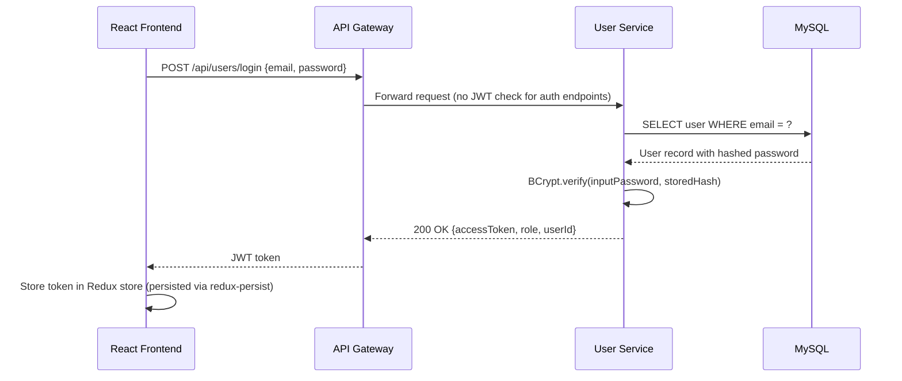
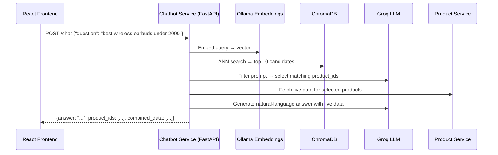
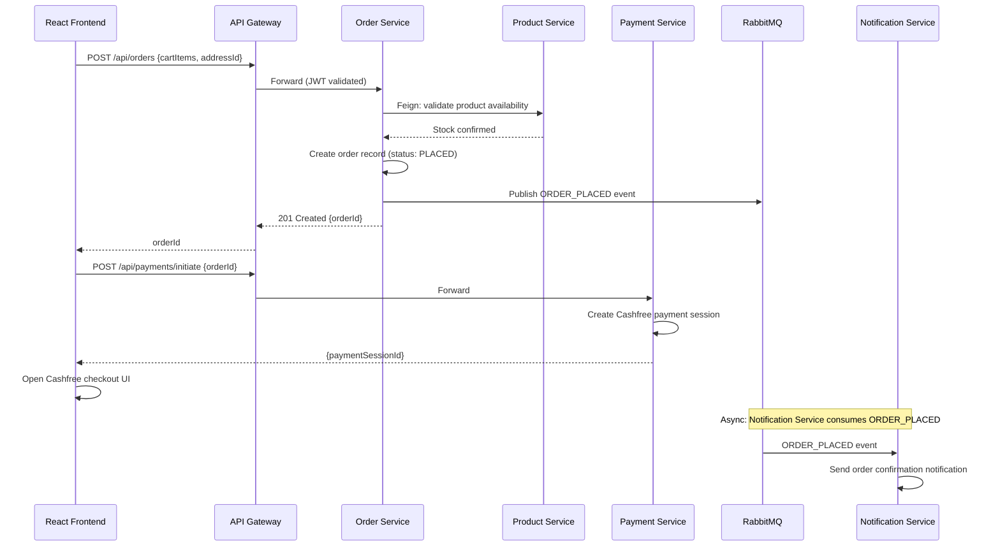
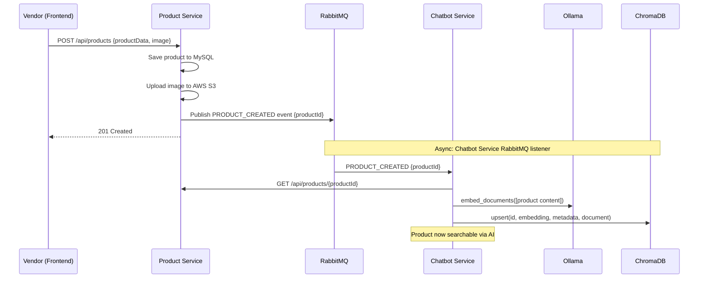
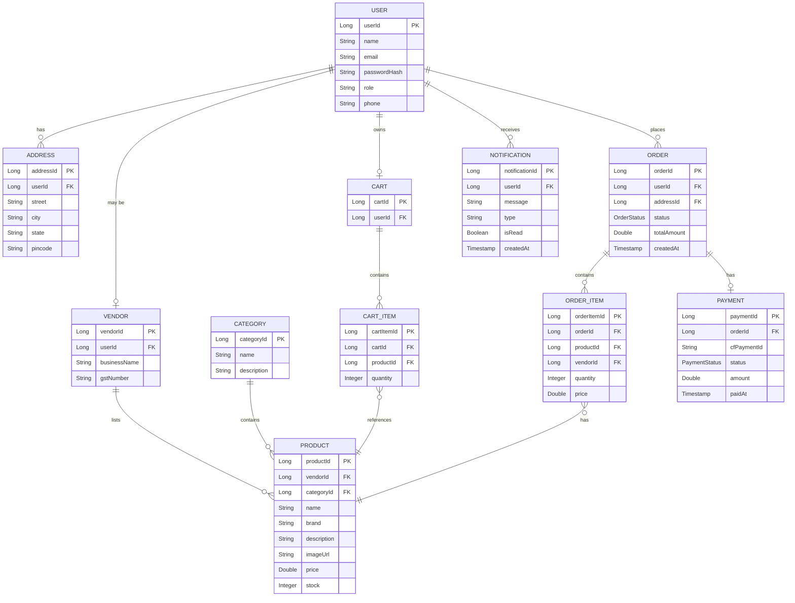
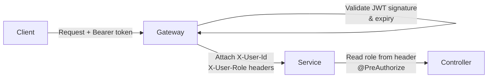
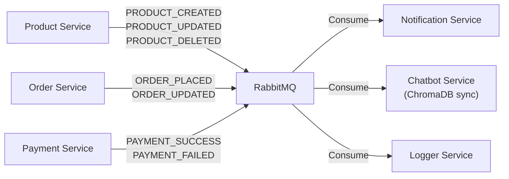

# IndiaMart – Multivendor E-Commerce Marketplace

> A production-style, cloud-deployable **multi-vendor e-commerce marketplace** built as a CDAC Advanced Computing final project. IndiaMart enables multiple vendors to list products, while customers can browse, search using AI-powered semantic search, manage carts, place orders, and make payments — all on a scalable microservices backbone.

[](https://openjdk.org/)
[](https://spring.io/projects/spring-boot)
[](https://reactjs.org/)
[](https://vitejs.dev/)
[](https://python.org/)
[](https://fastapi.tiangolo.com/)
[](https://docker.com/)
[](https://aws.amazon.com/)
[](LICENSE)

---

## Table of Contents

- [Project Overview](#project-overview)
- [Technology Stack](#technology-stack)
- [System Architecture](#system-architecture)
- [Microservices Overview](#microservices-overview)
- [AI / Semantic Search (Chatbot Service)](#ai--semantic-search-chatbot-service)
- [Core Features](#core-features)
- [Request Flows](#request-flows)
- [Database Design](#database-design)
- [Security](#security)
- [Microservices Communication](#microservices-communication)
- [Docker & Deployment](#docker--deployment)
- [API Overview](#api-overview)
- [Project Structure](#project-structure)
- [Local Development Setup](#local-development-setup)
- [Environment Variables](#environment-variables)
- [Observability & Logging](#observability--logging)
- [Error Handling](#error-handling)
- [Testing](#testing)
- [Performance & Scalability](#performance--scalability)
- [Challenges & Solutions](#challenges--solutions)
- [Future Enhancements](#future-enhancements)
- [Project Highlights](#project-highlights)
- [Team & Contributors](#team--contributors)
- [License](#license)

---

## Project Overview

IndiaMart is a **full-stack, cloud-deployed, multi-vendor e-commerce marketplace** following a microservices architecture. The platform supports three distinct roles:

| Role | Capabilities |
|------|-------------|
| **Customer** | Browse products, AI-powered search, cart, checkout, Cashfree payments, order tracking |
| **Vendor** | Register, list products with images (AWS S3), manage inventory, view vendor-specific orders |
| **Admin** | User/vendor management, product & category control, marketplace monitoring |

The backend is composed of **Java Spring Boot microservices** orchestrated via **Spring Cloud** (Gateway, Eureka, Config Server). A dedicated **Python/FastAPI AI Service** powers the intelligent chatbot and semantic product search using **LangChain + ChromaDB + Groq LLM + Ollama embeddings**. All services communicate via **REST** and **RabbitMQ** for asynchronous events.

---

## Technology Stack

| Layer | Technology | Purpose |
|-------|-----------|---------|
| **Frontend** | React 19 + Vite 8 | UI framework & build tool |
| **Styling** | Bootstrap 5 | Responsive component library |
| **State Management** | Redux Toolkit + Redux Persist | Global state & persistence |
| **HTTP Client** | Axios | REST API integration |
| **Charts** | Recharts | Vendor/admin dashboards |
| **Carousel** | Swiper | Product image sliders |
| **Payments (FE)** | Cashfree JS SDK | Payment gateway integration |
| **Backend** | Java 21 + Spring Boot 4.1 | Microservices REST APIs |
| **Persistence** | Spring Data JPA / Hibernate | ORM layer |
| **Service Discovery** | Netflix Eureka | Dynamic service registry |
| **API Gateway** | Spring Cloud Gateway | Single entry point & routing |
| **Config** | Spring Cloud Config Server | Centralised configuration |
| **Circuit Breaker** | Resilience4j | Fault tolerance |
| **Inter-service Calls** | OpenFeign | Declarative REST clients |
| **Messaging** | RabbitMQ | Async event-driven communication |
| **Database** | MySQL | Persistent relational storage |
| **Object Storage** | AWS S3 | Product image uploads |
| **AI / LLM** | Groq (openai/gpt-oss-20b) | LLM inference for chatbot |
| **Embeddings** | Ollama (nomic-embed-text) | Local embedding model |
| **Vector DB** | ChromaDB (persistent) | Semantic product search index |
| **AI Framework** | LangChain | Orchestration & RAG pipeline |
| **AI Service** | Python FastAPI | AI/chatbot microservice host |
| **Containerisation** | Docker + Docker Compose | Container management |
| **CI Deployment** | AWS EC2 (Amazon Linux) | Production hosting |
| **Image Registry** | Docker Hub | Container image distribution |
| **Logging** | Logger-Service (custom Java MS) | Centralised structured logging |
| **Validation** | Spring Boot Validation | Bean validation / JSR-380 |
| **Payments (BE)** | Cashfree Payment Gateway | Order payment processing |

---

## System Architecture


### Key Architectural Decisions

| Component | Rationale |
|-----------|-----------|
| **Single API Gateway** | Clients interact with one URL; routing, JWT validation, and CORS handled centrally |
| **Eureka Discovery** | Services register by name; no hardcoded inter-service URLs; supports horizontal scaling |
| **Config Server** | One place to manage all service configuration; supports environment-specific profiles |
| **RabbitMQ** | Decouples producers (Order, Payment, Product) from consumers (Notification, AI Service); failures don't cascade |
| **ChromaDB + Ollama** | Local, self-hosted vector search; no external vector DB cost; nomic-embed-text provides high-quality dense embeddings |
| **FastAPI AI Service** | Python ecosystem for AI/ML; FastAPI provides async REST endpoints with automatic OpenAPI docs |
| **AWS S3** | Durable, scalable object storage for product images; vendors upload via product-service which handles presigned URL logic |

---

## Microservices Overview

### 1. API Gateway (`api-gateway` — Port 9090)
- **Technology**: Spring Cloud Gateway
- Single entry point for all client traffic
- Routes requests to downstream services by URL path prefix
- Performs JWT token validation before forwarding requests
- Handles CORS centrally for the React frontend
- Integrates with Eureka for dynamic routing (no hardcoded service URLs)

### 2. Eureka Service Registry (`service-registry` — Port 8761)
- **Technology**: Spring Cloud Netflix Eureka Server
- All backend Spring Boot microservices register on startup and send heartbeats
- API Gateway and OpenFeign clients discover service instances dynamically
- Provides a web dashboard to inspect registered service health
- Enables load balancing across multiple instances of the same service

### 3. Config Server (`config-server` — Port 8888)
- **Technology**: Spring Cloud Config Server
- Centralises all application properties across microservices
- Services fetch configuration on startup; supports `application.yml` profiles (dev, prod)
- Eliminates duplicated configuration across service deployments
- Sensitive values are injected via environment variables; not stored in the config repo

### 4. User Service (`user-service` — Port 8081)
- **Technology**: Spring Boot 4.1 + Spring Data JPA + MySQL
- Handles user and vendor registration, login, and profile management
- Issues JWT access tokens on successful authentication
- Roles: `CUSTOMER`, `VENDOR`, `ADMIN`
- Manages user addresses for checkout
- Exposes internal endpoints consumed by other services via Feign for JWT validation

### 5. Product Service (`product-service` — Port 8080)
- **Technology**: Spring Boot 4.1 + Spring Data JPA + MySQL + AWS S3 SDK + OpenFeign + Resilience4j
- Full CRUD lifecycle for products and categories (vendor-scoped create/update/delete)
- Handles product image upload to **AWS S3** (public read, vendor write)
- Publishes product events (`PRODUCT_CREATED`, `PRODUCT_UPDATED`, `PRODUCT_DELETED`) to **RabbitMQ** so the AI chatbot service can sync its ChromaDB knowledge base
- Exposes `/internal/allProducts` endpoint consumed by the chatbot service for bulk knowledge-base sync
- Circuit breaker via Resilience4j on critical inter-service calls

### 6. Order Service (`order-service` — Port 8082)
- **Technology**: Spring Boot 4.1 + Spring Data JPA + MySQL + OpenFeign
- Manages the full order lifecycle: `PLACED → CONFIRMED → SHIPPED → DELIVERED`
- Creates orders from cart data; validates product availability via Feign calls to product-service
- Publishes `ORDER_PLACED` events to RabbitMQ for notification service
- Exposes vendor-specific order views (a vendor only sees orders containing their products)

### 7. Payment Service (`payment-service` — Port 8083)
- **Technology**: Spring Boot 4.1 + Spring Data JPA + MySQL + Cashfree Payment Gateway
- Integrates with the **Cashfree Payment Gateway** to initiate and verify payment sessions
- Stores payment records linked to orders with status (`PENDING`, `SUCCESS`, `FAILED`)
- Publishes payment status events to RabbitMQ on completion, triggering order and notification updates

### 8. Notification Service (`notification-service` — Port 8084)
- **Technology**: Spring Boot 4.1 + RabbitMQ Consumer
- Pure event consumer — listens to queues for order, payment, and product events
- Sends transactional notifications (email/in-app) to customers and vendors based on events
- Stateless and independently scalable

### 9. Logger Service (`Logger-Service`)
- **Technology**: Custom Java Spring Boot microservice
- Centralised structured logging across the platform
- Other services publish log events; Logger-Service persists them for audit and monitoring

### 10. Chatbot / AI Service (`chatbot-service` — Port 8085)
- **Technology**: Python + FastAPI + LangChain + ChromaDB + Ollama + Groq
- Semantic product search and AI-powered shopping assistant
- *(See dedicated [AI / Semantic Search](#ai--semantic-search-chatbot-service) section below)*

---

## AI / Semantic Search (Chatbot Service)

> **This feature is fully implemented.** The chatbot service is a standalone Python FastAPI application using Retrieval-Augmented Generation (RAG) to answer natural-language product queries.

### Why Semantic Search in E-Commerce?

Traditional keyword search fails when customers use natural language like *"I need something waterproof for hiking in the rain"* instead of exact product names. Semantic search converts both query and product descriptions into high-dimensional vector embeddings and finds products by **meaning**, not keyword matches.

### Component Breakdown

| Component | Technology | Role |
|-----------|-----------|------|
| **Embedding Model** | `nomic-embed-text` via Ollama | Converts product text and user queries to dense vectors locally |
| **Vector Database** | ChromaDB (persistent on disk) | Stores product embeddings; fast cosine similarity retrieval |
| **LLM** | Groq (`openai/gpt-oss-20b`) | Two-stage: (1) filter candidates, (2) generate natural-language answer |
| **Framework** | LangChain | Embedding abstraction; prompt management |
| **API** | FastAPI | Async REST endpoint with OpenAPI docs |
| **Event Listener** | RabbitMQ + Pika | Listens for product events to keep ChromaDB in sync automatically |

### Knowledge Base Sync

Product embeddings in ChromaDB stay current through two mechanisms:

1. **Initial Bulk Sync** (`knowledge_builder.py`): Fetches all products from `/internal/allProducts`, generates embeddings, and upserts into ChromaDB.
2. **Real-time Sync** (`rabbitmq_listener_2.py`): Listens on a RabbitMQ queue for `PRODUCT_CREATED`, `PRODUCT_UPDATED`, and `PRODUCT_DELETED` events published by the product-service. On each event, the corresponding product embedding is updated or deleted in ChromaDB — no manual re-sync needed.

### Product Document Structure (for embedding)

Each product is embedded as a structured text document:

```
Product Name: {name}
Description: {description}
Brand: {brand}
Category: {category}
```

Metadata stored alongside each embedding includes `productId`, `name`, `brand`, `category`, and `description` — allowing ChromaDB to return rich context without extra DB lookups.

### Two-Stage LLM Filtering

A single-stage vector search returns semantically similar products, but may include false positives. The chatbot uses a **two-stage approach**:

1. **Stage 1 – Candidate Selection**: ChromaDB returns top-10 candidates. Groq LLM receives all candidates and the user query, then returns only `product_ids` that genuinely match (brand, product type, and description alignment enforced via prompt rules).
2. **Stage 2 – Answer Generation**: Live product data (price, stock, availability) is fetched from the product-service for each selected ID. Groq generates a natural, helpful Markdown-formatted answer referencing live data.

This prevents the LLM from hallucinating and ensures answers always reflect current inventory.

---

## Core Features

### ✅ Implemented Features

#### Customer
- User registration and login with JWT authentication
- Role-based access control (Customer / Vendor / Admin)
- Product browsing by category
- AI-powered semantic product search (natural language queries)
- Product detail pages with images (hosted on AWS S3)
- Shopping cart management
- Address management for checkout
- Checkout with Cashfree payment gateway integration
- Order placement and order history
- Order status tracking (`PLACED → CONFIRMED → SHIPPED → DELIVERED`)
- Transactional notifications on order and payment events

#### Vendor
- Vendor registration and profile management
- Product creation, update, and deletion (CRUD)
- Product image upload to AWS S3
- Product inventory and pricing management
- Category assignment for products
- Vendor-specific order visibility (see only orders containing own products)
- Recharts-powered sales dashboard

#### Admin
- User and vendor account management
- Product and category management
- Platform-wide order management
- Marketplace monitoring and controls

### 🔮 Planned / Future Enhancements

- Wishlist / saved items
- Advanced product filtering and faceted search
- Seller analytics and revenue dashboard
- Real-time order tracking with WebSocket push notifications
- Product ratings and reviews

---

## Request Flows

### 1. User Login Flow



### 2. AI Product Search Flow



### 3. Order Placement Flow



### 4. Product Event → AI Sync Flow (Async via RabbitMQ)



---

## Database Design

> Each microservice owns its own MySQL database (database-per-service pattern). Services never directly query another service's database.

### Entity Relationships



---

## Security

### JWT Authentication Architecture



### Security Implementation Details

| Concern | Implementation |
|---------|---------------|
| **Password Storage** | BCrypt hashing (never stored plain-text) |
| **JWT Signing** | HS256 or RS256 with a secret injected via environment variable |
| **Token Validation** | Performed at the API Gateway before forwarding; downstream services trust the gateway headers |
| **Role-Based Access** | `CUSTOMER`, `VENDOR`, `ADMIN` roles enforced via Spring Security `@PreAuthorize` annotations |
| **CORS** | Configured at the API Gateway for the React frontend origin |
| **Sensitive Config** | Database credentials, JWT secret, Cashfree keys, AWS credentials — all via environment variables, never committed to Git |
| **Inter-service Trust** | Internal endpoints (e.g., `/internal/allProducts`) protected by network/gateway-level rules, not exposed publicly |
| **Input Validation** | `@Valid` + Hibernate Validator (JSR-380) on all request bodies |

### Role Access Matrix

| Endpoint Scope | CUSTOMER | VENDOR | ADMIN |
|---------------|----------|--------|-------|
| Browse products | ✅ | ✅ | ✅ |
| Manage own profile | ✅ | ✅ | ✅ |
| Create/edit products | ❌ | ✅ (own) | ✅ |
| View own orders | ✅ | ✅ (vendor items) | ✅ |
| Update order status | ❌ | ✅ (own) | ✅ |
| User management | ❌ | ❌ | ✅ |
| Category management | ❌ | ❌ | ✅ |

---

## Microservices Communication

### Synchronous Communication (REST via OpenFeign)

OpenFeign is used for service-to-service REST calls where a synchronous response is required:

```java
// Example: Order Service calling Product Service
@FeignClient(name = "PRODUCT-SERVICE")  // Resolves via Eureka
public interface ProductServiceClient {
    @GetMapping("/api/products/{id}")
    ProductDTO getProduct(@PathVariable Long id);
}
```

Eureka resolves `PRODUCT-SERVICE` to the actual host:port dynamically. Resilience4j circuit breakers wrap Feign calls to handle downstream failures gracefully.

### Asynchronous Communication (RabbitMQ)



**Why asynchronous?**
- Decouples producers from consumers — a notification service outage does not fail order placement
- Enables fan-out: one event consumed by multiple services (Notification + Logger + Chatbot)
- Natural retry and dead-letter queue support in RabbitMQ
- Product knowledge base stays current without scheduled batch jobs

---

## Docker & Deployment

### Container Strategy

Every service ships as a Docker image:
- **Spring Boot services**: Multi-stage `Dockerfile` — build stage with Maven, runtime stage with `eclipse-temurin:21-jre`
- **Chatbot Service**: Python `Dockerfile` with `python:3.11-slim`, installs dependencies from `requirement.txt`, runs with `uvicorn`
- Images are pushed to **Docker Hub** and pulled on the **AWS EC2** instance

### Docker Compose Architecture

```yaml
# Illustrative structure — refer to compose.yaml for actual configuration
services:
  service-registry:     # Eureka — starts first
  config-server:        # Config — depends on eureka
  api-gateway:          # Gateway — depends on config
  user-service:         # depends on config + db
  product-service:      # depends on config + db + rabbitmq
  order-service:        # depends on config + db
  payment-service:      # depends on config + db
  notification-service: # depends on rabbitmq
  logger-service:       # depends on rabbitmq
  chatbot-service:      # depends on rabbitmq + ollama
  mysql:                # MySQL database
  rabbitmq:             # Message broker
  ollama:               # Local embedding model server
```

All services share a Docker bridge network allowing hostname-based resolution (e.g., `http://product-service:8080`).

### Deploying on AWS EC2

```bash
# 1. Pull all images from Docker Hub
docker compose pull

# 2. Start all services in detached mode
docker compose up -d

# 3. Verify running containers
docker ps

# 4. View logs for a specific service
docker logs product-service --tail 100 -f

# 5. Restart a single service
docker restart api-gateway

# 6. Stop and remove all containers
docker compose down

# 7. List local images
docker images
```

### Container Health Check

```bash
# Check API Gateway is up
curl http://localhost:9090/actuator/health

# Check Eureka dashboard
open http://localhost:8761

# Check AI Service health
curl http://localhost:8085/health
```

---

## API Overview

> Note: Requests to the following services are routed via the API Gateway at `http://localhost:9090`. JWT `Authorization: Bearer <token>` header required for protected routes.

### User Service

| Method | Path | Auth | Description |
|--------|------|------|-------------|
| `POST` | `/api/users/register` | Public | Customer registration |
| `POST` | `/api/users/login` | Public | Login, returns JWT |
| `GET` | `/api/users/profile` | Customer+ | Get own profile |
| `PUT` | `/api/users/profile` | Customer+ | Update profile |
| `POST` | `/api/users/address` | Customer | Add delivery address |
| `GET` | `/api/users/address` | Customer | List addresses |
| `POST` | `/api/vendors/register` | Public | Vendor registration |

### Product Service

| Method | Path | Auth | Description |
|--------|------|------|-------------|
| `GET` | `/api/products` | Public | List all products (paginated) |
| `GET` | `/api/products/{id}` | Public | Product detail |
| `GET` | `/api/products/category/{id}` | Public | Products by category |
| `POST` | `/api/products` | Vendor | Create product (with S3 image upload) |
| `PUT` | `/api/products/{id}` | Vendor | Update own product |
| `DELETE` | `/api/products/{id}` | Vendor/Admin | Delete product |
| `GET` | `/api/categories` | Public | List categories |
| `POST` | `/api/categories` | Admin | Create category |

### Order Service

| Method | Path | Auth | Description |
|--------|------|------|-------------|
| `POST` | `/api/orders` | Customer | Place order |
| `GET` | `/api/orders/my` | Customer | Customer order history |
| `GET` | `/api/orders/vendor` | Vendor | Vendor-specific orders |
| `GET` | `/api/orders/{id}` | Customer/Vendor | Order details |
| `PUT` | `/api/orders/{id}/status` | Vendor/Admin | Update order status |

### Payment Service

| Method | Path | Auth | Description |
|--------|------|------|-------------|
| `POST` | `/api/payments/initiate` | Customer | Initiate Cashfree session |
| `POST` | `/api/payments/verify` | Customer | Verify payment after callback |
| `GET` | `/api/payments/{orderId}` | Customer | Payment status |

### Notification Service

| Method | Path | Auth | Description |
|--------|------|------|-------------|
| `GET` | `/api/notifications` | Customer+ | Get user notifications |
| `PUT` | `/api/notifications/{id}/read` | Customer+ | Mark as read |

### AI Chatbot Service (Direct — Port 8085)

| Method | Path | Auth | Description |
|--------|------|------|-------------|
| `POST` | `/chat` | Public | Semantic product search / Q&A |
| `GET` | `/health` | Public | Service health check |

---

## Project Structure

```text
IndiaMart-Multi-Vendor-Ecommerce-Marketplace/
│
├── frontend/                          # React 19 + Vite frontend
│   ├── src/
│   │   ├── apis/                      # Axios API call modules
│   │   ├── pages/                     # Page components (customer, vendor, admin)
│   │   ├── layouts/                   # Shared layout wrappers
│   │   ├── redux/                     # Redux Toolkit slices & store
│   │   └── routers/                   # React Router route config
│   ├── package.json
│   └── vite.config.js
│
├── backend/
│   ├── service-registry/              # Eureka Naming Server (Spring Boot)
│   ├── config-server/                 # Spring Cloud Config Server
│   ├── api-gateway/                   # Spring Cloud Gateway
│   ├── user-service/                  # User, Vendor, Auth, Address management
│   ├── product-service/               # Product CRUD, Categories, S3 upload
│   ├── order-service/                 # Order lifecycle management
│   ├── payment-service/               # Cashfree payment integration
│   ├── notification-service/          # Event-driven notifications (RabbitMQ consumer)
│   ├── Logger-Service/                # Centralised structured logging microservice
│   └── chatbot-service/               # Python FastAPI AI service
│       ├── main_2.py                  # FastAPI application & /chat endpoint
│       ├── chat_bot_logic_2.py        # RAG pipeline: embed → retrieve → LLM filter → answer
│       ├── knowledge_builder.py       # ChromaDB bulk sync from product-service
│       ├── rabbitmq_listener_2.py     # Real-time product event consumer
│       ├── chroma-db/                 # Persistent ChromaDB vector store
│       ├── Dockerfile
│       └── requirement.txt
│
├── compose.yaml                       # Docker Compose orchestration
└── README.md
```

---

## Local Development Setup

### Prerequisites

| Tool | Version | Purpose |
|------|---------|---------|
| Java | 21 | Spring Boot microservices |
| Maven | 3.9+ | Java build tool (`./mvnw` included) |
| Node.js | 20+ | React frontend |
| Python | 3.11+ | AI chatbot service |
| Docker | 24+ | Container runtime |
| Docker Compose | 2.x | Multi-container orchestration |
| Ollama | Latest | Local embedding model server |

### Step 1 – Clone the Repository

```bash
git clone https://github.com/your-org/IndiaMart-Multi-Vendor-Ecommerce-Marketplace.git
cd IndiaMart-Multi-Vendor-Ecommerce-Marketplace
```

### Step 2 – Start Infrastructure Services

```bash
# Start MySQL and RabbitMQ via Docker
docker compose up -d mysql rabbitmq
```

### Step 3 – Pull and Start Ollama Embedding Model

```bash
# Install Ollama (https://ollama.ai)
ollama serve
ollama pull nomic-embed-text
```

### Step 4 – Configure Environment Variables

Create a `.env` file in each service directory based on the `.env.example` (see [Environment Variables](#environment-variables)).

### Step 5 – Start Backend Microservices (order matters)

```bash
# 1. Eureka
cd backend/service-registry && ./mvnw spring-boot:run &

# 2. Config Server
cd backend/config-server && ./mvnw spring-boot:run &

# 3. API Gateway
cd backend/api-gateway && ./mvnw spring-boot:run &

# 4. Business services (any order after config server is up)
cd backend/user-service && ./mvnw spring-boot:run &
cd backend/product-service && ./mvnw spring-boot:run &
cd backend/order-service && ./mvnw spring-boot:run &
cd backend/payment-service && ./mvnw spring-boot:run &
cd backend/notification-service && ./mvnw spring-boot:run &
```

### Step 6 – Start the AI Chatbot Service

```bash
cd backend/chatbot-service
python -m venv .venv
source .venv/bin/activate       # Windows: .venv\Scripts\activate
pip install -r requirement.txt

# Initial knowledge-base sync (run once after product-service is up)
python knowledge_builder.py

# Start the FastAPI service
uvicorn main_2:app --host 0.0.0.0 --port 8085 --reload
```

### Step 7 – Start the Frontend

```bash
cd frontend
npm install
npm run dev
# Open http://localhost:5173
```

### Step 8 – Verify

| Service | URL |
|---------|-----|
| React Frontend | http://localhost:5173 |
| API Gateway | http://localhost:9090 |
| Eureka Dashboard | http://localhost:8761 |
| RabbitMQ Dashboard | http://localhost:15672 |
| AI Chatbot Docs | http://localhost:8085/docs |

---

## Environment Variables

> ⚠️ **Never commit real secrets to Git.** Use a `.env` file and ensure `.gitignore` excludes it.

### Backend Services (`.env` or `application.yml` overrides)

```env
# Database
DB_HOST=localhost
DB_PORT=3306
DB_NAME=indiamart_user_db
DB_USERNAME=your_db_username
DB_PASSWORD=your_db_password

# JWT
JWT_SECRET=your_very_long_jwt_secret_key_here
JWT_EXPIRATION_MS=86400000

# AWS S3 (product-service)
AWS_ACCESS_KEY_ID=your_aws_access_key
AWS_SECRET_ACCESS_KEY=your_aws_secret_key
AWS_REGION=ap-south-1
S3_BUCKET_NAME=your_s3_bucket_name

# Cashfree (payment-service)
CASHFREE_APP_ID=your_cashfree_app_id
CASHFREE_SECRET_KEY=your_cashfree_secret_key
CASHFREE_ENV=TEST

# RabbitMQ
RABBITMQ_HOST=localhost
RABBITMQ_PORT=5672
RABBITMQ_USERNAME=guest
RABBITMQ_PASSWORD=guest

# Eureka
EUREKA_SERVER_URL=http://localhost:8761/eureka
```

### Chatbot Service (`.env`)

```env
# LLM
GROQ_API_KEY=your_groq_api_key

# Ollama
OLLAMA_HOST=http://localhost:11434

# Product Service (internal)
SPRING_BASE_URL=http://localhost:8080

# RabbitMQ
RABBITMQ_HOST=localhost
RABBITMQ_PORT=5672
RABBITMQ_USERNAME=guest
RABBITMQ_PASSWORD=guest
```

### Frontend (`vite.config.js` / `.env`)

```env
VITE_API_BASE_URL=http://localhost:9090
VITE_CHATBOT_URL=http://localhost:8085
VITE_CASHFREE_ENV=TEST
```

---

## Observability & Logging

### Logger Service

A dedicated `Logger-Service` microservice acts as the centralised log aggregator for the platform. Other services publish structured log events to RabbitMQ; the Logger Service consumes them and persists for audit, debugging, and monitoring.

### Spring Boot Actuator

All Java microservices expose `/actuator/health` and `/actuator/info` via Spring Boot Actuator. These endpoints are:
- Used by Docker health checks to determine container readiness
- Scraped by monitoring tools for uptime tracking
- Accessible through the API Gateway for admin-level health monitoring

### Distributed Tracing

> Zipkin and OpenTelemetry are included in the architecture as planned observability components. Spring Boot Actuator with Micrometer is configured on all services. Full distributed trace propagation across service calls is a near-term enhancement.

**Why it matters in microservices**: A single customer request may touch the API Gateway → User Service → Order Service → Product Service. Without trace correlation, debugging a failure requires grepping logs across 4+ containers. Distributed tracing propagates a `traceId` through all service calls, letting you see the complete request timeline in one view.

---

## Error Handling

All Spring Boot services implement a **global exception handler** using `@RestControllerAdvice` that returns consistent JSON error responses:

```json
{
  "timestamp": "2024-08-17T10:30:00Z",
  "status": 404,
  "error": "Not Found",
  "message": "Product with id 42 not found",
  "path": "/api/products/42"
}
```

| HTTP Code | Scenario |
|-----------|---------|
| `400` | Validation failure (`@Valid` bean errors) |
| `401` | Missing or invalid JWT token |
| `403` | Insufficient role for the requested operation |
| `404` | Resource not found |
| `409` | Conflict (e.g., email already registered) |
| `500` | Unexpected internal server error |

Feign calls between services propagate HTTP error codes, allowing the calling service to react appropriately (e.g., return a 503 if stock check downstream fails, with Resilience4j fallback).

---

## Testing

### Backend

- **Unit Tests**: JUnit 5 + Mockito for service layer business logic
- **Integration Tests**: Spring Boot Test (`@SpringBootTest`) with embedded H2 or Testcontainers for isolated database testing
- **API Testing**: Postman collections were used to manually verify all REST endpoints throughout development

### Frontend

- Manual testing across customer, vendor, and admin user flows
- Browser-based UI testing for cart, checkout, and payment flows

### AI Service

- Unit-level testing of `answer_question()` logic with mocked ChromaDB and LLM responses
- Integration testing with the running product-service to validate knowledge-base sync and end-to-end query responses

---

## Performance & Scalability

| Mechanism | Benefit |
|-----------|---------|
| **Microservices independence** | Each service scales horizontally without affecting others |
| **Eureka load balancing** | Multiple instances of the same service are load-balanced automatically via Ribbon/Spring Cloud LoadBalancer |
| **Stateless JWT** | No server-side session; any instance handles any request |
| **RabbitMQ async processing** | Peak order/notification loads are buffered in queues, preventing downstream overload |
| **AWS S3** | Product images offloaded from application servers; CDN-deliverable |
| **Database-per-service** | Eliminates shared-DB bottlenecks; each service tuned for its own query profile |
| **Resilience4j circuit breakers** | Prevents cascading failures when a downstream service degrades |
| **API Gateway** | Centralised SSL termination, rate limiting (future), request caching potential |
| **ChromaDB ANN search** | Approximate Nearest Neighbour search returns top-10 candidates in milliseconds regardless of product catalogue size |

---

## Challenges & Solutions

| Challenge | Solution |
|-----------|---------|
| **Service startup ordering** | Docker Compose `depends_on` with `condition: service_healthy`; Spring retry on Config Server connection |
| **JWT propagation across services** | API Gateway validates and strips the raw token; injects `X-User-Id` and `X-User-Role` headers so downstream services don't need crypto dependencies |
| **CORS across microservices** | CORS handled centrally at the API Gateway; downstream services disable their own CORS to avoid double-header conflicts |
| **Real-time ChromaDB sync** | RabbitMQ event listener in the chatbot service receives product lifecycle events; no scheduled batch jobs or manual re-indexing |
| **Feign fallback on service unavailability** | Resilience4j circuit breaker on critical Feign clients; fallback returns a safe default response |
| **Multi-vendor order visibility** | `ORDER_ITEM` stores `vendorId`; order-service filters by vendorId for vendor-specific queries without exposing other vendors' data |
| **Image storage at scale** | AWS S3 with direct upload from product-service; `imageUrl` stored in MySQL; frontend renders directly from S3 |
| **Two-stage LLM filtering** | Vector similarity alone returns false positives; a selection prompt forces the LLM to confirm genuine matches before generating the final answer — eliminates hallucinated product recommendations |
| **Docker inter-container networking** | All services on a shared `bridge` network in `compose.yaml`; services communicate via container name as hostname |

---

## Future Enhancements

- [ ] **Elasticsearch / OpenSearch** — Full-text and faceted product search alongside semantic search
- [ ] **Kubernetes deployment** — Horizontal Pod Autoscaler, rolling updates, Helm charts
- [ ] **CI/CD pipeline** — GitHub Actions: build → test → Docker build → push to Docker Hub → deploy to EC2
- [ ] **Personalized AI recommendations** — User purchase history as additional embedding context
- [ ] **Seller analytics dashboard** — Revenue trends, bestsellers, return rates
- [ ] **Real-time notifications** — WebSocket push for order/payment status updates
- [ ] **Redis caching** — Cache product listings and category data to reduce DB load
- [ ] **Zipkin / OpenTelemetry** — Full distributed trace propagation with Zipkin UI
- [ ] **Advanced fraud detection** — Payment pattern analysis for suspicious transactions
- [ ] **Product reviews and ratings** — Customer feedback system
- [ ] **Cloud-native database scaling** — Amazon RDS Multi-AZ for production HA

---

## Project Highlights

> _The strongest technical aspects of this project for interviews and portfolio review_

1. **Real RAG Pipeline**: The chatbot service implements a production-quality two-stage Retrieval-Augmented Generation pipeline — not a demo wrapper. It uses local Ollama embeddings, persistent ChromaDB vector storage, Groq LLM inference, and live product data enrichment.

2. **Real-time AI Knowledge Sync**: Product embeddings in ChromaDB are updated automatically via RabbitMQ events whenever vendors create, update, or delete products — no manual re-indexing.

3. **True Microservices Architecture**: 10 independently deployable services with service discovery (Eureka), centralised configuration (Config Server), and a single gateway entry point. Each service owns its own database.

4. **Production Payment Integration**: Real Cashfree payment gateway integration with both frontend SDK and backend session/verification APIs — not a mocked payment flow.

5. **AWS S3 Product Images**: Vendor product images are stored in and served from AWS S3, demonstrating cloud object storage integration in a real application context.

6. **Event-Driven Async Architecture**: RabbitMQ fan-out enables Notification, Logger, and AI services to react to business events independently — a real-world microservices pattern.

7. **Resilience4j Circuit Breakers**: Critical inter-service Feign calls are wrapped with circuit breakers to prevent cascading failures — a production reliability requirement.

8. **Full-Stack Deployment**: The entire platform (10 Java + Python services + frontend) is containerised with Docker and deployed on AWS EC2 using Docker Compose.

---

## Team & Contributors

```
Team Members (CDAC Advanced Computing Batch)
─────────────────────────────────────────────
Member 1 – Backend Microservices (User, Order, Product Services)
Member 2 – Frontend (React, Redux, UI/UX)
Member 3 – AI / Chatbot Service (LangChain, ChromaDB, RAG Pipeline)
Member 4 – DevOps, Payment Integration & Deployment (Docker, AWS, Cashfree)
```

---

## License

This project is developed as part of the **CDAC Advanced Computing** academic programme. It is made available under the [MIT License](LICENSE) for educational and portfolio purposes.

---

<div align="center">

**Built with ❤️ by the IndiaMart Team — CDAC Advanced Computing**

_A real-world microservices e-commerce platform demonstrating distributed systems, AI-powered search, cloud deployment, and modern full-stack development._

</div>
